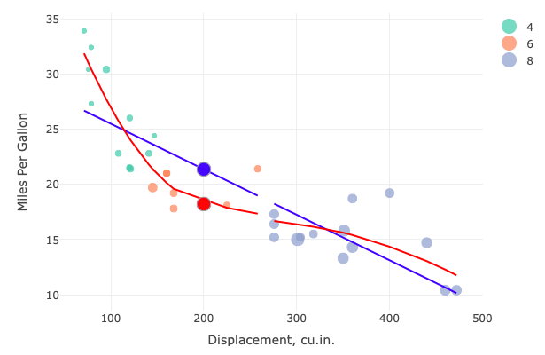

Peer-graded Assignment: Course Project: Shiny Application and Reproducible Pitch
========================================================
class: illustration
author: Boris Romanciuc
date: 10 December 2018
autosize: true
- <https://boris-13.shinyapps.io/shiny_app/>
- mtcars has 10 features for mpg
- Minimal linear model: mpg ~ wt
- Optimal linear model: mpg ~ wt + hp + cyl + am

Course Project
========================================================
- This is the final presentation for the Course Project
- The course is focused on Developing Data Products
- The main objective of the project is to write a Shiny application

This was built as part of a deliverable for the course Developing Data Products as part of the Coursera Data Science Specialization.

Source code for ui.R and server.R files are available on the GitHub repo: <https://github.com/boris-13/shiny_app/>.

Embeded Code in the Slide
========================================================
- The following code calculates <span style="font-weight:bold; color:darkblue;">mpg</span> prediction on given <span style="font-weight:bold; color:darkblue;">weight</span> based on minimal linear regression model 
- The output shows the predicted <span style="font-weight:bold; color:darkblue;">mpg</span> value and the lower and upper limits of the confidence interval

```r
fit <- lm(mpg ~ wt, data = mtcars)

predict(fit, newdata = data.frame(wt = 3.45), interval="confidence")
```

```
      fit     lwr    upr
1 18.8467 17.7154 19.978
```
Moto Trend Shiny Application: Dataset
========================================================
- For this assignment, we used the mtcars dataset.
- The data was extracted from the <span style="font-weight:bold; color:darkblue;">1974 Motor Trend US</span> magazine, and comprises fuel consumption and 10 aspects of automobile design and performance for 32 automobiles (1973–74 models).
- Some information about the dataset:


```r
head(mtcars[,1:5])
```

```
                   mpg cyl disp  hp drat
Mazda RX4         21.0   6  160 110 3.90
Mazda RX4 Wag     21.0   6  160 110 3.90
Datsun 710        22.8   4  108  93 3.85
Hornet 4 Drive    21.4   6  258 110 3.08
Hornet Sportabout 18.7   8  360 175 3.15
Valiant           18.1   6  225 105 2.76
```

Plot MPG vs Displacement (mtcars dataset)
========================================================
- mpg~disp plot
- lm regression line
- loess regression line


